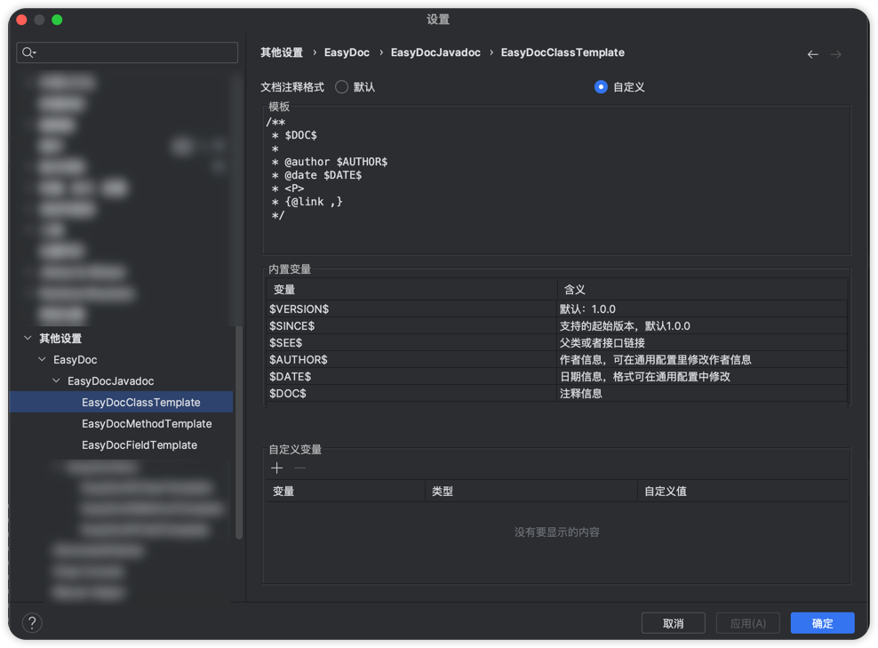
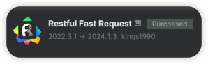

# 乐树相关工具

## 代码生成器 [点击进入](https://www.hblshq.cn)


## 开发插件推荐

### 1. 注释插件


相关配置信息
```
classTemplate:

/**
 * $DOC$
 * 
 * @author $AUTHOR$
 * @date $DATE$
 * <P>
 * {@link ,}
 */
 
 
 methodTemplate:
 
 /**
 * $DOC$
 * 
 * $PARAMS$
 * $RETURN$
 * @author $AUTHOR$
 * @date $DATE$
 * $THROWS$
 * {@link, }
 */
 
 filedTemplat:
 
 /**     $DOC$ */
```


---

### 2. 接口测试



---

### 3. mybatis 插件


--- 
